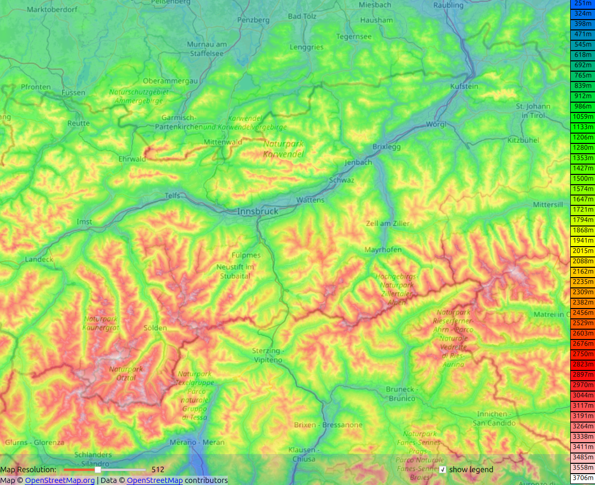

# OsmTerrainTool

## Description

Show osm map with elevation data based on dtm (currently only .hgt files are supported).

## Requirements

* Currently only tested on Ubuntu
* Qt6.8 or higher
* Download dtm (.hgt) files from your favourite website (recommended: https://sonny.4lima.de/)
* in QtCreator set project environment variable SRC_PATH to project root directory
* adjust settings.ini, set relative path (home dir) to dtm folder and add your tile server url to access osm

## Upcoming Plans/Ideas

* Use .json file to highlight country borders.
* Get lowest and highest point at a given radius around selected location
* Show slope map
* Search and center view to a given coordinate
* Search and center view to a given city name
* Import .gpx file and show route on map
* Show vertical profile of this route in separate window 

## Known Bugs
* Zooming out does not work quite well, maps turns white
* Save settings via menu is not implemented yet
